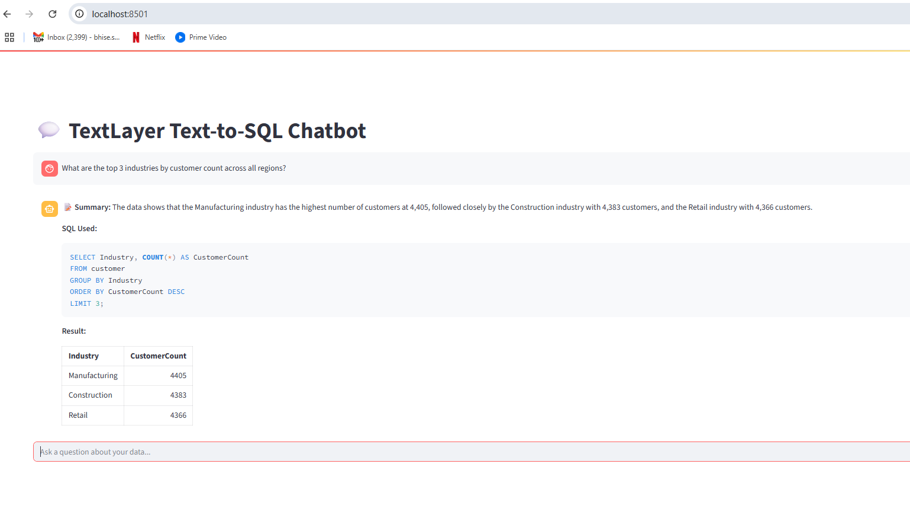

# Text-to-SQL LLM Integration

This update introduces an integrated Text-to-SQL tool powered by GPT-4o, capable of translating natural language questions into SQL, executing them on DuckDB, and summarizing the result in plain English.

---

## ✅ Summary of Changes

###  Core Processor Integration

I updated the `ProcessChatMessageCommand` to support:

- Tool calling via `text_to_sql` function
- Schema introspection and sampling
- SQL generation and execution via LLM
- A second round of LLM-based "judging" to improve summary clarity

The tool now supports complete natural-language-to-result functionality directly in `/v1/threads/chat`.

### 📦 New Route (for Streamlit Testing)

I also created a separate callable function `text_to_sql(question: str)`:
- Designed to be easily invoked from Streamlit or CLI.
- Lets you test isolated logic (schema retrieval, SQL generation, result summarization).

Run it via:

```bash
doppler run -c dev -- python -m streamlit run streamlit_chatbot.py
```

You can interact with the chatbot in the Streamlit UI .



---

## 🧪 Sample cURL Commands for Testing

### 1. Customers by Region

```bash
curl -X POST http://localhost:8000/v1/threads/chat \
  -H "Content-Type: application/json" \
  -d '{
    "messages": [
      {
        "role": "user",
        "content": "What is the total number of customers in each region (West, Midwest, Southeast, Southwest, Northeast)?"
      }
    ]
  }'
```

Response:

```
{"correlation_id":"cf0e8750-464a-42ce-8218-3f31b65b210c","payload":[{"content":"What is the total number of customers in each region (West, Midwest, Southeast, Southwest, Northeast)?","role":"user"},{"content":null,"finish_reason":"tool_calls","id":"2ce273f8-0c9a-4e27-b3ba-f531323bc3a3","role":"assistant","timestamp":["2025-06-25 01:18:06.676812841"],"tool_calls":[{"function":{"arguments":"{\"question\":\"What is the total number of customers in each region (West, Midwest, Southeast, Southwest, Northeast)?\"}","name":"text_to_sql"},"id":"call_TEpki4TAP1oLb17G4eyPvGjU","type":"function"}]},{"content":"{\"value\": \"The table shows the total number of customers from various locations. The highest number of customers is in the US-IL region with 1,371 customers, while the lowest is in an unspecified location with 24 customers. Other notable locations with high customer counts include FR (1,346), AU (1,341), and GB (1,314).\"}","id":"87dd5d4d-20a9-4291-9431-79bbb316431f","role":"tool","timestamp":["2025-06-25 01:18:10.897094499"],"tool_call_id":"call_TEpki4TAP1oLb17G4eyPvGjU"}],"status":200}
```

---

### 2. Top 3 Industries by Customer Count

```bash
curl -X POST http://localhost:8000/v1/threads/chat \
  -H "Content-Type: application/json" \
  -d '{
    "messages": [
      {
        "role": "user",
        "content": "What are the top 3 industries by customer count across all regions?"
      }
    ]
  }'
```

Response:

```
{"correlation_id":"bc235d83-7cd3-4dad-93f1-79f59fac9ef1","payload":[{"content":"What are the top 3 industries by customer count across all regions?","role":"user"},{"content":null,"finish_reason":"tool_calls","id":"f3ef478b-587b-4c5a-95ea-1788990f2cf0","role":"assistant","timestamp":["2025-06-25 01:17:12.735600302"],"tool_calls":[{"function":{"arguments":"{\"question\":\"What are the top 3 industries by customer count across all regions?\"}","name":"text_to_sql"},"id":"call_gDgkbelPXuAHOQnROhUzj6x3","type":"function"}]},{"content":"{\"value\": \"The data shows that the Manufacturing industry has the highest number of customers at 4,405, closely followed by the Construction industry with 4,383 customers, and the Retail industry with 4,366 customers.\"}","id":"8b01c68b-d36a-428a-a03d-caab76d0e318","role":"tool","timestamp":["2025-06-25 01:17:15.508189201"],"tool_call_id":"call_gDgkbelPXuAHOQnROhUzj6x3"}],"status":200}
```

---

## 📁 Files Updated

- `process_chat_message.py`: Integrated full LLM-to-DB workflow
- `text_to_sql.py`: Introduced helper functions for schema/sample retrieval, SQL parsing, LLM prompt engineering, and result summarization

---

You can now use either the REST API or the Streamlit interface for end-to-end testing.
